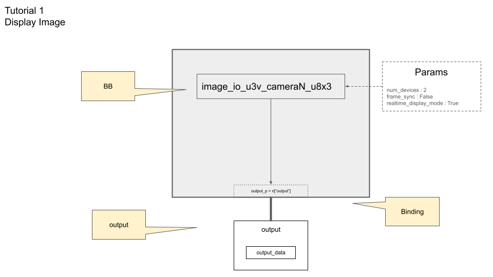

# Display Image

In this tutorial, we learn how to get image data from device with ion-kit, and display with OpenCV.

## Prerequisite

* OpenCV (installed with sensing-dev SDK) 
* ion-kit (installed with sensing-dev SDK) 

## Tutorial

### Get Device Information

To display image with ionpy, we need to get the following information of the device.

* Width
* Height
* PixelFormat

The [previous tutorial](obtain-device-info.md) or [arv-tool-0.8](../../external/aravis/arv-tools.md) will help to get these values.

### Build a pipeline

As we learned in the [introduction](../intro.mdx), we will build and execute pipeline for image I/O and processing.

In this tutorial, we build a very simple pipeline has only one Building Block that obtain image from U3V camera.

The following ionpy API set up our pipeline.

```c++
#define MODULE_NAME "ion-bb"
...
// pipeline setup
Builder b;
b.set_target(Halide::get_host_target());
b.with_bb_module(MODULE_NAME);
```

The `set_target` specifies on what hardware the pipeline built by the Builder will run. 

Since we woule like to use BB defined in `ion-bb.dll`, we need to load the module by `with_bb_module` function. 

The BB we are going use for obtaining image data is `image_io_u3v_cameraN_u8x2`, which is designed for U3V camera that has 8-bit depth for each pixel data and 2 dimension; e.g. Mono8.

With the device pixelformat Mono10 or Mono12, you need `image_io_u3v_cameraN_u16x2` since 16-bit depth pixel is required to store 10-bit and 12-bit pixel data respectively.

If the pixelformat is RGB8, it means bit depth is 8 and dimension is 3 (in addition to width and height, it has color channel) so you would use `image_io_u3v_cameraN_u8x3`.

Any of these BB requries input called `dispose`, `gain`, and `exposuretime`, so we have to se the port to pass the values to the pipeline.

```c++
// set port
Port dispose_p{ "dispose",  Halide::type_of<bool>() };
Port gain_p{ "gain", Halide::type_of<double>(), 1 };
Port exposure_p{ "exposure", Halide::type_of<double>(), 1 };
```

While port input is dynamic; i.e. it can be updated for each run, you can set static values in string via `Param`. 

```c++
#define FEATURE_GAIN_KEY "Gain"
#define FEATURE_EXPOSURE_KEY "ExposureTime"
...
Param num_devices{"num_devices", std::to_string(num_device)};
Param pixel_format{"pixel_format_ptr", pixel_format};
Param frame_sync{"frame_sync", "true"};
Param gain_key{"gain_key", FEATURE_GAIN_KEY};
Param exposure_key{"exposure_key", FEATURE_EXPOSURE_KEY};
Param realtime_diaplay_mode{"realtime_diaplay_mode", "false"};
```

`pixel_format` is the pixelformat that you obtained with [Get Device Information](#get-device-information).

:::caution why it does not work
`gain_key` and `exposure_key` are the feature key of GenICam to control device gain and exposure time. With **SFNC (Standard Features Naming Convention)** by emva; they are usually set `Gain` and `ExposureTime` in `FLOAT64`; however, some device has different key and different type.

In that case, you may need to change the type of port and name of the keys of param. [This page](../external/aravis/arv-tools#list-the-available-genicam-features) to check how to list the available features.
```c++

#define FEATURE_GAIN_KEY <name of the feature to control gain>
#define FEATURE_EXPOSURE_KEY <name of the feature to control exposure time>

Port gain_p{ "gain", Halide::type_of<TypeCode for your device>(), 1 };
Port exposure_p{ "exposure", Halide::type_of<TypeCode for your device>(), 1 };
```
:::

Now, you add BB to your pipeline as node with ports and params.

```c++
Node n = b.add(bb_name[pixel_format])(dispose_p, gain_p, exposure_p)
    .set_param(
    num_devices,
    pixel_format,
    frame_sync,
    gain_key,
    exposure_key,
    realtime_diaplay_mode
    );
```

Since this is the only one BB in our pipeline, output port of the node can be the output port of the pipeline, and we name is `output_p`.

Our pipeline with BB and port looks like this:



To pass the input values and get the output data from port, we prepare the buffers and mapping the buffer to port for input and port to buffer for output.

```c++
// create halide buffer for input port
double *gains = (double*) malloc (sizeof (double) * num_device);
double *exposures = (double*) malloc (sizeof (double) * num_device);
for (int i = 0; i < num_device; ++i){
    gains[i] = 40.0;
    exposures[i] = 100.0;
}
Halide::Buffer<double> gain_buf(gains, std::vector< int >{num_device});
Halide::Buffer<double> exposure_buf(exposures, std::vector< int >{num_device});

// create halide buffer for output port
std::vector< int > buf_size = std::vector < int >{ width, height };
if (pixel_format == "RGB8"){
    buf_size.push_back(3);
}
std::vector<Halide::Buffer<T>> output;
for (int i = 0; i < num_device; ++i){
    output.push_back(Halide::Buffer<T>(buf_size));
}

// set I/O ports
PortMap pm;
pm.set(dispose_p, false);
pm.set(gain_p, gain_buf);
pm.set(exposure_p, exposure_buf);
pm.set(n["output"], output);
```

Note that `buf_size` here is designed for 2D image. If the pixel format is RGB8, you need to set `(width, height, 3)` to add color channel.

`T` is the type of the output buffer; e.g. `uint8_t` for Mono8 and RGB8 while `uint16_t` for Mono10 and Mono12.

### Execute the pipeline

The pipeline is ready to run.

In our tutorial code, while gain and exposure time values mapping to input port are optional, dispose the device needs to be set to `false` while running and `true` at the end of program execution so that device would be safely closed.

```c++
for (int i = 0; i < loop_num; ++i){
    pm.set(dispose_p, i == loop_num-1);
    b.run(pm);
    ...
}
```

After setting the dynamic port, use `b.run(pm);` to execute the pipeline.

### Display with OpenCV

Since our output data (i.e. image data) is mapped into **the vector of Buffer** `output`, we can copy this to OpenCV buffer to image process or display.

Note that OpenCV has dirfferent order of channel (dimension) on their buffer.

```c++
for (int i = 0; i < num_device; ++i){
cv::Mat img(height, width, opencv_mat_type[pixel_format]);
std::memcpy(img.ptr(), output[i].data(), output[i].size_in_bytes());
img *= positive_pow(2, num_bit_shift_map[pixel_format]);
cv::imshow("image" + std::to_string(i), img);
}
```
`opencv_mat_type[pixel_format]` depends on PixelFormat (the bit-depth and dimension) of image data; e.g. `CV_8UC1` for Mono8, `CV_8UC3` for RGB8 while `CV_16UC1` for Mono10 and Mono12.

We can copy `output[i]` to the OpenCV Mat object to display.

```c++
cv::imshow("image" + std::to_string(i), img);
cv2.waitKey(1)
```

Note that `output` is the vector of Buffer (so that you many set `num_device` more than `1` to control multiple devices), you access `outpus[0]` to get image data.

Repeating the set of this process in `for` loop successfully shows the sequential images from camera device. 

## Complete code

Complete code used in the tutorial is [here](https://github.com/Sensing-Dev/tutorials/blob/main/cpp/src/tutorial1_display.cpp)

You can Use the CMakeLists.txt provided [here](https://github.com/Sensing-Dev/tutorials/blob/main/cpp/CMAKELists.txt) to compile and build the program.