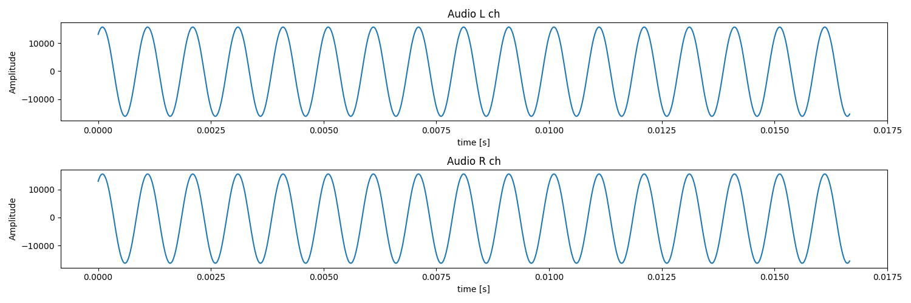

# Parse GenDC data

In this tutorial, we learn how to use GenDC separator library.
If your device data format is non-GenDC (general camera acquire images), see the next tutorial page [Parse non-GenDC binary data](./parse-image-bin.md).

If your device is not in GenDC format but you would like to learn about, you can Download sample GenDC which has 6 valid components out of 9 components with 4 different sensor data.

import links from "@site/static/external_link/links.js"

<div class="jsx-section">
<div class="board">
<a class="card" href={links.gendc_sample_data}>sample GenDC data</a>
</div></div>

## Prerequisite
 
* GenDC Separator (installed with sensing-dev SDK) 
* GenDC Data (obtained in the previous tutorial or Download sample from <a href={links.gendc_sample_data}>this page</a>).

## Tutorial

In the [previous tutorial](save-gendc), we learned how to save GenDC data into a binary file. Now, we will load the data, parse the container, and retrieve some information about the sensor from its descriptor.

:::note
We assume that GenDC used in this tutorial contains at lease one image data component. If your saved data in the previous tutorial, please download sample data from <a href={links.gendc_sample_data}>this page</a>.
:::

### GenDC

GenDC, or Generic Data Container, is defined by the EMVA (European Machine Vision Association). True to its name, it can contain any types of data defined by the camera device, regardless of the data dimension, metadata, or whether they are image sequences/bursts. 

While the format rule is defined in [the official document](https://www.emva.org/wp-content/uploads/GenICam_GenDC_v1_1.pdf), GenDC Separator helps you with easily parsing the whole container.

If you would like to learn the overview of GenDC, please check [this page](../../lessons/GenDC) that gives you the concept and rough structure of GenDC.

### Find Binary file.   

If you use the binary file saved in the previous tutorial, the name of the directory should be `tutorial_save_gendc_XXXXXXXXXXXXXX` and binary file prefix is `gendc0-`.

```cpp
std::string directory_name = "tutorial_save_gendc_XXXXXXXXXXXXXX";
std::string prefix = "gendc0-";
```

:::info
The complete code provided at the end of this tutorial gives you the command line option.

If you set `-d tutorial_save_gendc_XXXXXXXXXXXXXX` or `--directory tutorial_save_gendc_XXXXXXXXXXXXXX` option when you execute the tutorial program, `directory_name` will be automatically set.

Also, if you are using sample data `output.bin` provided at the top of this tutorial page, you can simply add `-u` or `--use-dummy-data` option so that the program look for downloaded `output.bin`. 
:::

The following snippet attempts to retrieve all binary files starting with a specified prefix from a directory. It then reorders all the found binaries according to their recorded order.

```cpp
std::vector<std::string> bin_files;
    for (const auto& entry : std::filesystem::directory_iterator(directory_name)) {
        if (entry.path().filename().string().find(prefix) == 0 && entry.is_regular_file() && entry.path().extension() == ".bin") {
            bin_files.push_back(entry.path().filename().string());
        }
    }

    //re-order binary files to sensor0-0.bin, sensor0-1.bin, sensor0-2.bin...
    std::sort(bin_files.begin(), bin_files.end(), [](const std::string& a, const std::string& b) {
        return extractNumber(a) < extractNumber(b);
    });
```

Now, we go through all ordered binary files in `bin_files` with for loop.

```cpp
for (const auto& filename : bin_files){

}
```

### Open and load Binary file.  

In the for loop, our target (single) binary file is `filename`. We open this binary file is `ifstream`.

```cpp
std::filesystem::path jth_bin= std::filesystem::path(directory_name) / std::filesystem::path(filename);
std::ifstream ifs(jth_bin, std::ios::binary);
```

To obtain the size of whole binary file, you set the ifstream at the end of file so that the distance between the current position and the beginning of the file is equal to the filesize. 

```cpp
ifs.seekg(0, std::ios::end);
std::streampos filesize = ifs.tellg();
```

Do not forget to put the ifstream back to the beginning of the file to load the content.

```cpp
ifs.seekg(0, std::ios::beg);
char* filecontent = new char[filesize];
```

### Parse binary file

GenDC Separator has `isGenDC` to check if the data has GenDC signature. Before parsing the whole data, it is always a good idea to make sure if the data is actually saved as GenDC format.

```cpp
isGenDC(filecontent);
```

If it returns `true`, we can create an GenDC `ContainerHeader` object from the data. To learn some terminologies of GenDC, such as *Container*, *Component*, and *Part*, please check [this page](../../lessons/GenDC).
```cpp
ContainerHeader gendc_descriptor = ContainerHeader(filecontent);
```

Now this object contains all information written in the GenDC *Descriptor*. You can get the size of *Descriptor* and the size of data. 
```cpp
int32_t descriptor_size = gendc_descriptor.getDescriptorSize();
int64_t container_data_size = gendc_descriptor.getDataSize();
```

The whole container size is the summation of this DescriptorSize and DataSize, so if you want to load the next container information, you can just add the total as the offset of the original data.
```cpp
ContainerHeader next_gendc_descriptor= ContainerHeader(filecontent + descriptor_size + data_size);
```

In this tutorial, we will detect which *Component* has image sensor data, get some properties of the sensor data such as 1. how many channels 2. Dimension of data, and 3. Byte-depth of data, and finally display the image with OpenCV.

First of all, we need to find the first available image data *Component* with `getFirstComponentIndexByTypeID()`, which returns the index of the first available data *Component* if its datatype matches the parameter. If it returns `-1`, it means no valid data is set on the sensor side.

Here are some datatype difined by GenICam.

| Datatype key | Datatype ID Value |
|--------------|-------------------|
| Undefined    | 0                 |
| Intensity    | 1                 |
| Infrared     | 2                 |
| Ultraviolet  | 3                 |
| Range        | 4                 |
| ...          | ...               |
| Metadata     | 0x8001            |

[reference: 4.13ComponentIDValue on GenICam Standard Features Naming Convention](https://www.emva.org/wp-content/uploads/GenICam_SFNC_v2_7.pdf)


Since we want to get image (i.e. intensity) data, use `1` for Datatype ID Value.


```cpp
// get first available image component
int32_t image_component_index = gendc_descriptor.getFirstComponentIndexByTypeID(1);
```

Now, we can access the header information of the *Component* that contains the image data.
```cpp
ComponentHeader image_component = gendc_descriptor.getComponentByIndex(image_component_index);
```

The *Component* has one or more *Parts*. We can iterate through them using a for loop. The number of *Parts* for image *Components* are usually the number of color channel. e.g. 1 for Monochrome-space image and 3 for general color-pixel-format such as RGB.

```cpp
int part_count = image_component.getPartCount();
for (int idx = 0; idx < part_count; idx++) {
    PartHeader part = image_component.getPartByIndex(idx);
    int part_data_size = part.getDataSize();
```

To copy image data, we need to create a buffer to store the data in each Part.
```cpp
uint8_t* imagedata;
imagedata = new uint8_t [part_data_size];
part.getData(reinterpret_cast<char *>(imagedata));
```

Currently, the image data is in a 1D array format `imagedata`. To display the preview image, we can reshape it by setting the following information:
* Width
* Height
* Color-channel
* Byte-depth

`getDimension()` returns a vector containing the width and height.
```cpp
std::vector <int32_t> image_dimension = part.getDimension();
```

To determine the byte-depth, you can calculate it from the total size of the data and the obtained dimension values above.

```cpp
int32_t bd = part_data_size / WxH;
```

Now, we copy the data from 1D array `imagedata` to the image-formatized cv::Mat `img` with `memcpy` to display:
```cpp
cv::Mat img(image_dimension[1], image_dimension[0], CV_8UC1);
std::memcpy(img.ptr(), imagedata, datasize);
cv::imshow("First available image component", img);

cv::waitKeyEx(1);
```

Note that CvMat type system varies depends on the byte-depth and color-channel. Generally the format is `CV_<bit-depth><signed/unsigned>C<number of channel>`. See the detail in [official document](https://docs.opencv.org/4.x/d1/d1b/group__core__hal__interface.html).


If you use sample data provided at the top of this page, you may see the image like this:

.

### Example with Sample Data

In the previous section, we learned general idea of parsing GenDC data with GenDC Separator API. Now, we can use sample data provided at the top of this page (or <a href={links.gendc_sample_data}>here</a>)) to handle some non-image data.

.

As we have done for image sensor data, we can get 1. how many channels 2. Dimension of data, and 3. Byte-depth of data. We also provide visualize tutorial code for Python version [Visualize GenDC data](.../python/visualize-gendc).

Since all non-image data's Datatype is Metadata, we need another information to access each component. So, finding the target *Component* by TypeId may not be a good idea.

Usually, each *Component* has uniquie SourceId to detect the data. This time, we use `getFirstComponentIndexBySourceId` to look for the target *Component*.

| Component Index | Sensor type | Validity | SourceId | TypeId            |
|-----------------|-------------|----------|----------|-------------------|
| 0               | Image       | valid    | 0x1001   | 1 (Intensity)     |
| 1               | Audio       | valid    | 0x2001   | 0x8001 (Metadata) |
| 2               | Analog 1    | valid    | 0x3001   | 0x8001 (Metadata) |
| 3               | Analog 2    | valid    | 0x3002   | 0x8001 (Metadata) |
| 4               | Analog 3    | valid    | 0x3003   | 0x8001 (Metadata) |
| 5               | PMOD        | valid    | 0x4001   | 0x8001 (Metadata) |
| 6               | extra       | invalid  | 0x0001   | 0x8001 (Metadata) |
| 7               | N/A         | invalid  | 0x5001   | 0x8001 (Metadata) |
| 8               | N/A         | invalid  | 0x6001   | 0x8001 (Metadata) |

#### Obtain audio data

Once we know the index of target *Component*, we can create `ComponentHeader` object as well as we did in image *Component*.

```cpp
int audio_component_index = gendc_descriptor.getFirstComponentIndexBySourceId(0x2001);
ComponentHeader audio_component = gendc_descriptor.getComponentByIndex(audio_component_index);
```

This *Container* has 2 Parts and they have **Left** and **Right channel** of audio data respectively.
```cpp
int audio_part_count = audio_component.getPartCount();
```

:::info
Some of audio sensor uses interleaved audio, which store Lch and Rch in the same *Part* in turns.
In this case, `audio_component.getPartCount()` returns 1, but you need to re-shape the data into 2-dim to use it.
:::

As we did for image *Component*, we check the data size and dimension of each *Part*.

```cpp
for (int idx = 0; idx < audio_part_count; idx++) {
    PartHeader part = audio_component.getPartByIndex(idx);
    int part_data_size = part.getDataSize();
    std::vector <int32_t> audio_dimension = part.getDimension();
```

Here, `audio_dimension` is `{800}`. Typically, the image *Component* of GenDC stores one frame of data, while other sensor data store samples obtained during the time it takes to acquire one frame of that image data. For example, if the images are being acquired at 60fps, only the samples obtained within 1/60 of a second are stored. This audio data is sampled at 48kHz, and since 800 samples are acquired within 1/60 of a second, the dimension becomes 800.

To know the data-type of this audio data, you need the byte-depth, which can be calculated with the size of data and dimension.

```cpp
int32_t bd = part_data_size / 800;
```

Since `part_data_size` is 1600, we now know the byte-depth is `2`, so the data-type is `int16_t`. 

If you visualize this data with [Python tutorial code](../python/visualize-gendc), you may see the following plot:

.


#### Obtain analog data

This GenDC data has 3 analog sensors which has identifier `0x3001`, `0x3002`, and `0x3003`. We can find the index of *Component* with `getFirstComponentIndexBySourceId()` as well.

```cpp
int analog_component_index = gendc_descriptor.getFirstComponentIndexBySourceId(0x3001);
ComponentHeader analog_component = gendc_descriptor.getComponentByIndex(analog_component_index);
```

Each analog sensor's * * has a single *Part*, which can be confirmed with `getPartCount()`.

```cpp
int analog_part_count = analog_component.getPartCount();
```

You can get *Part* to know data size, dimension (number of samples), and byte-depth as well.

```cpp
for (int idx = 0; idx < analog_part_count; idx++) {
    PartHeader part = analog_component.getPartByIndex(idx);
    int part_data_size = part.getDataSize();
    std::vector <int32_t> analog_dimension = part.getDimension();
}
```

If you visualize this data with [Python tutorial code](../python/visualize-gendc), you may see the following plot:

.

#### Obtain PMOD data

This GenDC data has 1 PMOD accelerometer sensor, which is connected to accelerometer recording the x, y, and z coordinate information. Therefore, the number of *Parts* is 3.

```cpp
int pmod_component_index = gendc_descriptor.getFirstComponentIndexBySourceId(0x4001);
ComponentHeader pmod_component = gendc_descriptor.getComponentByIndex(pmod_component_index);
int pmod_part_count = pmod_component.getPartCount();
```

:::info
Some of accelerometer sensor uses interleaved structure, which store X, Y, and Z coordinate in the same *Part* in turns.
In this case, `pmod_component.getPartCount()` returns 1, but you need to re-shape the data into 3-dim (or 4-dim with 1 dummy channel) to use it.
:::

You can get *Part* to know data size, dimension (number of samples), and byte-depth as well.

```cpp
for (int idx = 0; idx < pmod_part_count; idx++) {
    PartHeader part = pmod_component.getPartByIndex(idx);
    int part_data_size = part.getDataSize();
    std::vector <int32_t> pmod_dimension = part.getDimension();
    ...
```

Since each *Part* have x, y, and z data respectively, with [Python tutorial code](../python/visualize-gendc), you may see the following plot:

.

#### Use Typespecific information

If you want to access some device-specific data stored in `TypeSpecific` field of GenDC *Part*. 

For example, the sample GenDC data has `framecount` data at the lower 4 bytes of the 8-byte TypeSpecific3, which represents the device-generated unique id for each frame.

Note that TypeSpecific starts from N = 1, 2, 3... and index is 0, 1, 2... so the index of TypeSpecific3 is 2.

```cpp
int64_t typespecific3 = part.getTypeSpecificByIndex(2);
int32_t framecount = static_cast<int32_t>(typespecific3 & 0xFFFFFFFF);
std::cout << "Framecount: " << framecount<< std::endl;          
```


## Complete code

import {tutorial_version} from "@site/static/version_const/latest.js"
import GenerateTutorialLink from '@site/static/tutorial_link.js';

<GenerateTutorialLink language="cpp" tag={tutorial_version} tutorialfile="tutorial5_parse_gendc_data" />
