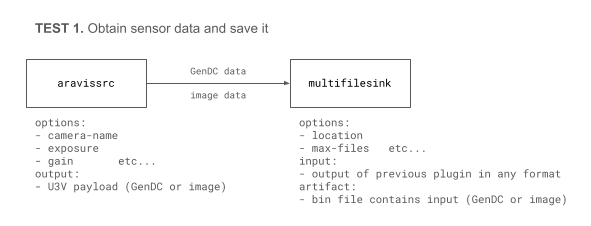

# Gstreamerのツールについて

**GStreamer** は、マルチメディア処理のフレームワークとしてAPIを提供しています。サンプルツールをインストールすると、簡易的にいくつかの機能を使用することができます。。

| Name | Description |
| --------   | ------- |
| gst-inspect-1.0 | GStreamer プラグインの情報を表示します |
| gst-launch-1.0 | 文字列形式で構築した GStreamer パイプラインを実行します |

## ツールのインストール方法

Windows ではオプション `-InstallGstTools`、Linux では `--install-gst-tools` を指定してインストーラーを実行すると、これらのツールが Sensing-Dev SDK の他のコンポーネントと共にインストールされます。詳細については [セットアップガイド](../../startup-guide/software-stack.mdx) を参照してください。

## 利用可能なプラグインの一覧を確認する (gst-inspect-1.0)

`gst-inspect-1.0` を使用すると、マシンにインストールされているすべてのプラグインの一覧を表示できます。インストールスクリプトを使用して Sensing-Dev をインストールし、環境変数を設定していれば（[セットアップガイド](../../startup-guide/software-stack.mdx) を参照）、Aravis の `aravissrc` や GenDC の `gendcseparator` といった GStreamer プラグインが表示されます。


```bash
aravis:  aravissrc: Aravis Video Source
gendcseparator:  gendcseparator: GenDCSeparator
staticelements:  bin: Generic bin
staticelements:  pipeline: Pipeline object
```

:::caution なぜ動作しないのか
 期待するプラグインがリストに表示されない、または「WARNING 'Failed to load plugin'」が表示される場合、以下が原因として考えられます。
* 別のインストーラーで異なるバージョンの SDK コンポーネントをインストールしたためにバージョンの競合が発生している。
* 環境変数が正しく設定されていない（特にLinuxは手動で設定する必要があります）。
  * `GST_PLUGIN_PATH`
  * `PATH`: Windows
  * `LD_LIBRARY_PATH`: Linux 
:::

## プラグイン・エレメントの情報を表示する (gst-inspect-1.0)

`gst-inspect-1.0` <要素またはプラグインの名前> を実行すると、特定の GStreamer `プラグインまたは要素に関する情報を表示します。以下は、gendcseparator` の一部情報を表示した例です。Factory Details、Plugin Details、Pad Templates、Element Properties/Signals などの情報が表示され、パイプラインの構築に役立ちます。

```bash
$ gst-inspect-1.0.exe gendcseparator
...
Pad Templates:
  SRC template: 'component_src%u'
    Availability: Sometimes
    Capabilities:
      ANY

  SINK template: 'sink'
    Availability: Always
    Capabilities:
      ANY

  SRC template: 'src'
    Availability: Always
    Capabilities:
      ANY
...

Element Properties:
  name                : The name of the object
                        flags: readable, writable
                        String. Default: "gendcseparator0"
  parent              : The parent of the object
                        flags: readable, writable
                        Object of type "GstObject"
  silent              : Produce verbose output ?
                        flags: readable, writable
                        Boolean. Default: true

...
```

## パイプラインを実行する (gst-launch-1.0)

通常、GStreamer API を使用してパイプラインを構築・実行しますが、`gst-launch-1.0` を使うと、各要素を `!` で連結した文字列形式でパイプラインを簡易的にビルドし、実行できます。詳細は [GStreamer チュートリアル](./gst-launch.md) を参照してください。

以下の例では、`aravissrc`（Aravis GStreamer プラグインのソース要素）からセンサーデータを取得し、そのデータを `multifilesink`（multifile プラグインのシンク要素）を使って `output%d.bin` に保存します。

```
gst-launch-1.0 aravissrc camera-name=<camera name> ! multifilesink location=output%d.bin
```

