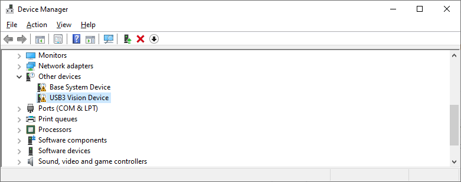
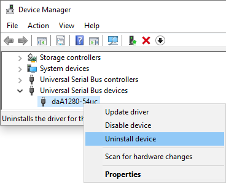
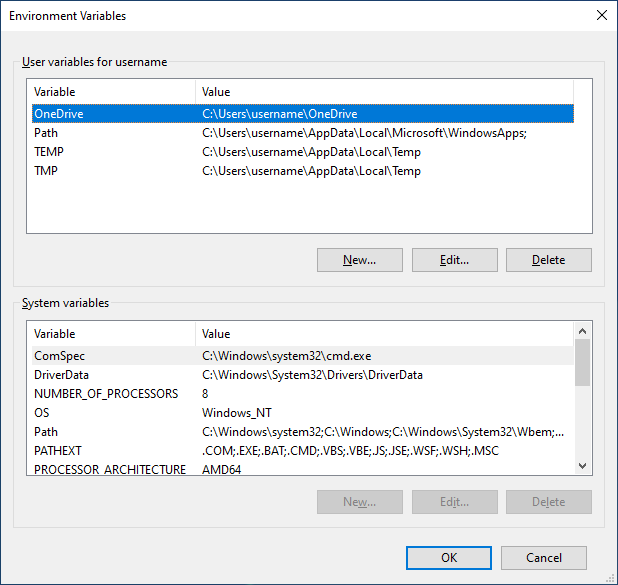

# インストール - Windows

このドキュメントでは、Kizashiハードウェアおよびソフトウェア開発環境、およびオーディオ/ビデオ同期録音サンプルアプリケーションHarmonyのインストール手順について説明します。これは、Windowsで開発を始める人々のためのものです。

import '/src/css/home.css';
import {latest_installer_URL, latest_winUSB_installer_URL} from "@site/static/config.js"


<div class="jsx-section">
<div class="board">
<a class="card" href={latest_installer_URL}>Windows 64ビットパッケージをダウンロード</a>
</div></div>

## 期待される環境

このドキュメントでは、以下の環境を前提としています。

* OS: Windows 10/11、64ビット版
* 開発環境（いずれか）
    * Python 3.11（VS Codeとともに）
    * C++: Visual Studio 2019/2022
* ハードウェア:
    * USB3.0互換USBポート x2

## 必要なもの

* Python 3.11

## Sensing-devソフトウェアパッケージ

ページのトップにあるインストーラースクリプトをダウンロードするか、<a href={latest_installer_URL}>こちら</a>からダウンロードしてください。

Windowsで管理者権限を持っていて、最小限のコンポーネントをインストールしたい場合、ダウンロードしたスクリプトを右クリックして「PowerShellで実行」を選択するだけで済みます。

それ以外の場合、PowerShellターミナルを開いて`.\installer.ps1 -user <ユーザー名>`と入力します。

OpenCVをお持ちでなく、チュートリアルなどでご利用になりたい方はオプションに`-InstallOpenCV`とつけてください。

デフォルトのインストールパスは`"C:\Users\<ユーザー名>\AppData\Local\sensing-dev-installer"`です。

:::caution なぜ動作しないのか
次のエラーが表示された場合：

> installer.ps1 cannot be loaded because running scripts is disabled on this system

PowerShellはスクリプトの実行を許可していない可能性があります。その場合、次の例のように`-ExecutionPolicy Bypass`オプションを追加してください。

```bash
powershell.exe -ExecutionPolicy Bypass -File .\installer.ps1 -user <ユーザー名>
```
:::

Pythonで開発を進めたい場合、pipでionpyをインストールしてください。

```bash
pip3 install -U pip
pip3 install ion-python==1.0
pip3 install gendc-python==0.1.0
```


## U3VデバイスにWinUSBドライバーをインストール

U3Vカメラデバイスがホストマシンに初めて接続される場合にのみ、この手順が必要です。

1. タスクバーの検索ボックスに「device manager」と入力し、メニューからDevice Managerを選択して、U3Vカメラデバイスを確認してください。



画像には、ホストマシンに接続された2つの未知のU3Vカメラデバイスが表示されており、WinUSBドライバーをインストールする必要があります。

2. **<a href={latest_winUSB_installer_URL}>こちら</a>**からスクリプトをダウンロードし、PowerShellで右クリックして実行してください。
このプロセスには、アカウントに管理者権限が必要であり、最大で5分かかる場合があります。


3. もし以下の画像であなたのデバイス名が見えるなら、WinUSBドライバーがインストールされています。


次の画像でデバイス名が表示されている場合、WinUSBドライバーがインストールされています。

:::tip ドライバーをアンインストールしたい場合

1. 再度デバイスマネージャーを開き、デバイスを右クリックして、「デバイスのアンインストール」を選択してください。



2. チェックボックスをクリックして、「デバイスのアンインストール」をクリックしてください。


3. "Action"を開き、"scan for hardware changes"をクリックしてください。


もしデバイスが未知のデバイスとして表示されているなら、おめでとうございます！WinUSBドライバーは正常にアンインストールされました！
:::


## 環境変数の設定

installer.ps1スクリプトを実行すると、SDKが必要とする環境変数`%PATH%`と`%SENSING_DEV_ROOT%`を**自動的に設定**しますので、このステップをスキップできます。

ただし、デフォルトのパスを変更したり、パッケージの場所を移動した場合は、次の手順で手動で設定する必要があります。

1. Windowsキー **&#8862;** を押すか、タスクバーの角にある **&#8862;** をクリックしてスタートメニューを使用します。

2. **Environment variable** と入力して、**アカウントの環境変数を編集** を探して、**環境変数** ウィンドウを開きます。


3. ウィンドウの上部および下部にはユーザーとシステム用の環境変数があり、ユーザー変数を編集します。



4. `新規` および `編集` を使用して、次の環境変数を設定します。

| 変数名 | 値 | 新規/編集（追加） |
| --------   | ------- | ------- |
| SENSING_DEV_ROOT | `<SDKをインストールした場所>` | 新規 |
| PATH | `<SDKをインストールした場所>/bin` | 編集（追加） |

:::info 確認
`arv-tool-0.8`を使用することで、ソフトウェアパッケージが適切にインストールされているか確認できるかもしれません。手順については、[このページ](../external/aravis/arv-tools.md)を確認してください。
:::