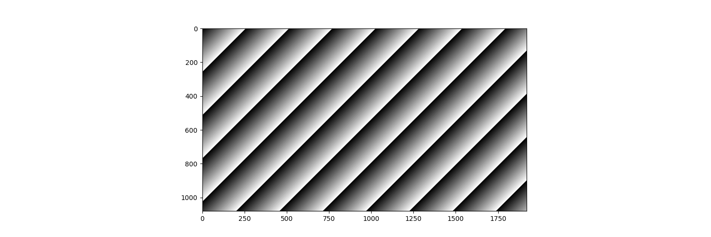
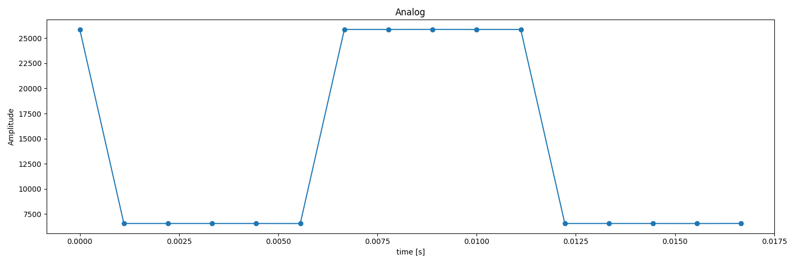

# GenDCデータの可視化

このチュートリアルでは、[前回のチュートリアル](./parse-gendc)で解析したサンプルGenDCデータを可視化する方法を学びます。

## 前提条件

このチュートリアルでは解析したデータをグラフに起こすために `matplotlib`を使用します。以下の手順でモジュールをインストールしてください。

<pre>
<code class="language-bash">
pip3 install -U pip<br />
pip3 install matplotlib
</code>
</pre>

import links from "@site/static/external_link/links.js"

* GenDCデータ（前回のチュートリアルで取得したもの、または<a href={links.gendc_sample_data}>こちらのページ</a>からサンプルをダウンロード）。

## チュートリアル

[前回のチュートリアル](parse-gendc)では、バイナリファイルからGenDCデータを解析する方法を学びました。各パートデータを取得した後、それをアプリケーションで使用できるようにフォーマッティングする例として、このチュートリアルでは各データをmatplotlibを使ってグラフに描画します。

:::note
このチュートリアルでは<a href={links.gendc_sample_data}>サンプルデータ</a>を使用します。
:::

### GenDC

GenDCの概要を学びたい場合は、[こちらのページ](../../lessons/GenDC)をご覧ください。GenDCの概念と大まかな構造が説明されています。

### バイナリファイルの検索と読み込み

バイナリファイルの読み込みについては、[前回のチュートリアル](parse-gendc)を確認してください。*Part* では、画像の生データを取得できます。

```python
binary_image = part.get_data()
```

### 画像の可視化

[前回のチュートリアル](parse-gendc)では、画像データを持つ*Component*が `0` であることを確認しました。

また、以下のデータもあります：
* dimension = (1920, 1080)
* byte_depth = 1

これらのプロパティを使って、バイナリ画像データを `uint8` 型のnumpy配列に変換できます。

```python
np_image = np.frombuffer(binary_image, dtype=get_numpy_dtype(byte_depth, unsinged=True))
```

現在の `np_image` は1D配列なので、幅 x 高さの形に再形成できます。

`get_dimension()` で取得したリストに入っている次元情報は画像の幅と高さの順序で返されますが、matplotlibは高さ、幅の順序を要求します。

```python
WxH = dimension
HxW = dimension[::-1]
image_data = np_image.reshape(HxW)
```

上記のコードスニペットは、次のように1行で書くこともできます：

```python
image_data = np.frombuffer(part.get_data(), dtype=get_numpy_dtype(byte_depth, unsinged=True)).reshape(dimension[::-1])
```

これで、`imshow()` を使って画像データを表示できます。

```python
image_fig = plt.figure(figsize=(15, 5))
plt.imshow(image_data, cmap='gist_gray')
plt.show()
```

.


### 音声データの可視化

[前回のチュートリアル](parse-gendc)では、音声データを持つ*Component*が `1` であることを確認しました。

また、以下のデータも取得しています。
* channel = 2
* dimension = (800,)
* byte_depth = 2

これらのプロパティを使って、画像*Component*と同様にバイナリ音声データを `int16` 型のnumpy配列に変換できます。

```python
for j in range(part_count):
    part = audio_component.get_part_by_index(j)
    dimension = (800,)
    byte_depth = 2

    audio_part_data = np.frombuffer(part.get_data(), dtype=get_numpy_dtype(byte_depth, unsinged=False)).reshape(dimension)
```

この音声センサーデータは、1フレームの画像データを取得する間に得られたサンプルを格納しており、そのフレームレートは60fpsです。

したがって、描画するサンプルが取得された時間の範囲は0から1/60秒です。

```python
num_samples = audio_part_data.shape[0]
times = np.linspace(0, 1/image_fps, num=num_samples)[:num_samples]
```

次のようにsubplotを使って、2つの*Part*の図を同じ図に配置できます：

```python
audio_fig = plt.figure(figsize=(15, 5))
for j in range(part_count):
    part = audio_component.get_part_by_index(j)
    dimension = (800,)
    byte_depth = 2

    audio_part_data = np.frombuffer(part.get_data(), dtype=get_numpy_dtype(byte_depth, unsinged=False)).reshape(dimension)

    ax = audio_fig.add_subplot(part_count, 1, j+1)
    ax.plot(times, audio_part_data)
plt.show()
```

.

:::info
一部の音声センサーは、LchとRchを交互に同じ*Part*に格納するインタリーブ構造を使用します。
この場合、`audio_component.get_part_count()`は1を返しますが、データを2次元に再形成して次のように使用する必要があります：

```python
part = audio_component.get_part_by_index(j)
dimension = (800, 2)
byte_depth = 2

audio_part_data = np.frombuffer(part.get_data(), dtype=get_numpy_dtype(byte_depth, unsinged=False)).reshape(dimension)

Lch_data = audio_part_data[:, 0]
Rch_data = audio_part_data[:, 1]
```
:::

### アナログデータの可視化

[前回のチュートリアル](parse-gendc)では、アナログデータを持つ*Component*が `2`, `3`, および `4` であることを確認しました。

また、以下のデータも取得しています。
* channel = 1
* dimension = (16,)
* byte_depth = 2

*Part*データを取得し、X軸の時間軸を生成する方法は次の通りです：
```python
for j in range(part_count):
    part = analog_component.get_part_by_index(j)
    dimension = (16,)
    byte_depth = 2

    analog_part_data = np.frombuffer(part.get_data(), dtype=get_numpy_dtype(byte_depth, unsinged=False)).reshape(dimension)
    num_samples = analog_part_data.shape[0]

    times = np.linspace(0, num_samples/(image_fps * num_samples), num=num_samples)[:num_samples]
```

dimensionは1/60秒間に取得されたサンプルの数を表しているため、視覚化には16のデータポイントが表示されます。

```python
analog_fig = plt.figure(figsize=(15, 5))
ax = analog_fig.add_subplot(1, 1, +1)
ax.plot(times, analog_part_data, marker = 'o')
plt.show()
```

.

### PMODデータの可視化

[前回のチュートリアル](parse-gendc)では、加速度計データを持つ*Component*が `5` であることを確認しました。

また、以下のデータも取得しています。
* channel = 3
* dimension = (16,)
* byte_depth = 2

各*Part*はX、Y、Zの座標を表しているので、各*Part*のデータを `XYZ` のリストに追加します。

```python
XYZ = []

for j in range(part_count):
    part = pmog_component.get_part_by_index(j)
    dimension = (16,)
    byte_depth = 2

    pmod_part_data = np.frombuffer(part.get_data(), dtype=get_numpy_dtype(byte_depth, unsinged=False)).reshape(dimension)
    XYZ.append(pmod_part_data)
```

これで、XYZを3D空間にプロットしてカメラの加速度を見ることができます。センサーが一部の時点で加速していなかったため、サンプル数が16未満に見えることがあります。

```python
pmod_fig = plt.figure(figsize=(15, 10))
ax = pmod_fig.add_subplot(projection='3d')
ax.plot(XYZ[0], XYZ[1], XYZ[2], marker = 'o')
plt.show()
```

.

:::info
一部の加速度計センサーは、X、Y、Zの座標を交互に同じ*Part*に格納するインタリーブ構造を使用します。
この場合、`pmog_component.get_part_count()`は1を返しますが、次のように4次元（x、y、z、およびパディング）にデータを再形成する必要があります：

```python
part = pmod_component.get_part_by_index(j)
dimension = (800, 4)
byte_depth = 2

pmod_part_data = np.frombuffer(part.get_data(), dtype=get_numpy_dtype(byte_depth, unsinged=False)).reshape(dimension)

X = pmod_part_data[:, 0]
Y = pmod_part_data[:, 1]
Z = pmod_part_data[:, 2]
```
:::

## Complete code

import {tutorial_version} from "@site/static/version_const/latest.js"
import GenerateTutorialLink from '@site/static/tutorial_link.js';

<GenerateTutorialLink language="python" tag={tutorial_version} tutorialfile="tutorial5_visualize_gendc_data" />
