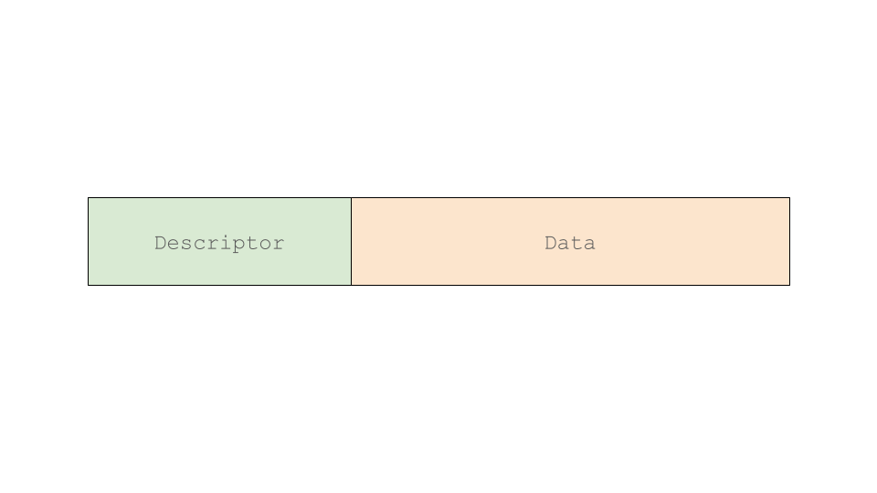
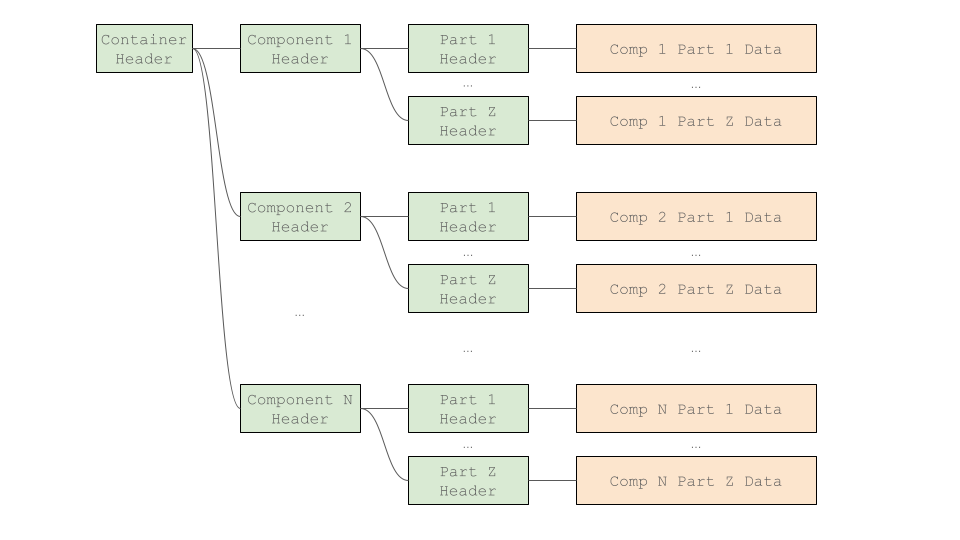

# GenDC

[GenICam (Generic Interface for Cameras)](https://www.emva.org/standards-technology/genicam/) は、[**EMVA**&#128279;](https://www.emva.org/) によって定義された汎用のソフトウェア標準です。API、命名規則、トランスポート層、制御プロトコル、およびデータコンテナを規定しています。

このドキュメントでは、リポジトリ内に提供されているサンプルデータを使用してGenDC（Generic Data Container）の基礎知識を学びます。

GenICamの概要については、[About U3V Camera](camera) ページをご覧ください。

## GenDCの概念

名前が示すように、GenDCは汎用データのために設計されています。GenDCに保存されるデータには、画像データ（2D、3D、マルチスペクトル）、音声データ、またはその他のメタデータが含まれる可能性があります。保存されるデータは単一または複数である可能性があります。

保存されるデータが任意の型、サイズ、次元、および形式であり得るため、GenDCをロードする人がコンテナ内のデータが何であるかを知るために、データについての注釈を含める必要があります。

それらを記載するため、GenDCには、データの詳細を説明する*Descriptor*がデータと一緒に含まれています。

公式ドキュメントは、EMVAが提供する[こちら](https://www.emva.org/wp-content/uploads/GenICam_GenDC_v1_1.pdf)です。

## Descriptor/Data と Container/Component/Part

前のセクションで説明したように、GenDCは2つの異なるサブモジュール、*Descriptor*と*Data*で構成されています。*Descriptor*は含まれるデータのすべての詳細を説明します。



上記の構造に加え、GenDCは複数のデータをまとめて管理するために、*Container*、*Component*、および*Part*の3つの異なるレベルを設定する階層構造を持っています。*Container*は全体のGenDCを表し、1つ以上の*Components*を持ち、各*Component*は1つ以上の*Parts*を含みます。各レベルの*Descriptor*は*Header*と呼ばれ、各*Part*がGenDC内の実際のデータを扱います。



たとえば、GenDCに単一の2Dモノクロ画像を保存したい場合、*Container*には1つの*Component*があり、その*Component*には1つの*Part*があります。

一方で2D RGB平面強度画像とそのメタデータをGenDCに保存したい場合は、画像用の*Component*とメタデータ用の*Component*の2つを持つことができます。さらに、画像用の*Component*にはR、G、およびBデータをそれぞれ保存するための3つの*Parts*があり、メタデータ用の*Component*にはメタデータチャンクを保存するための1つの*Part*が必要になるかもしれません。

## ヘッダーの内容

今までに、*Descriptor*（*Container Header*、*Component Header*、*Part Header*）がGenDC内のデータに関するすべての情報を含むことがわかりました。実際にこのデータを使用するには、データがGenDC内のどこに位置しているか（オフセット）、データのサイズ、およびそれが何を表しているかを知る必要があります。

どの情報が*Header*に位置するかを公式文書から知ることは可能ですが、コンテナに複数の*Components*と*Parts*がある場合にはすべてを把握するのが難しくなります。

そのため、*Descriptor*内のプロパティを簡単に取得するために、[**GenDC Separator**](https://github.com/Sensing-Dev/GenDC)を導入します。

GenDC Separatorを使用せずにコードを書いた場合、*Descriptor*内のターゲットプロパティのサイズとオフセットを知る必要があります。以下は、"最初のコンポーネントのデータの次元"（*component1_part1_dimension*）を取得する例です。値56、48、および40は、それぞれのHeader内のターゲットプロパティのオフセットです。また、データが1Dまたは2Dかどうかを確認する必要があります。

```cpp
int64_t component1_offset = *(reinterpret_cast<int64_t*>(gendc_binary_data + 56));
int64_t component1_part1_offset = *(reinterpret_cast<int64_t*>(gendc_binary_data + component1_offset + 48));
int16_t component1_part1_headertype = *(reinterpret_cast<int16_t*>(gendc_binary_data + component1_part1_offset));

if ((component1_part1_headertype & 0xFF00) == 0x4100){
    // データは1D
    std::vector<int32_t> component1_part1_dimension(1);
    int64_t target_raw_data = *(reinterpret_cast<int64_t*>(gendc_binary_data + component1_part1_offset + 40));
    component1_part1_dimension[0] = static_cast<int32_t>(target_raw_data);
}else if ((component1_part1_headertype & 0xFF00) == 0x4200){
    // データは2D
    std::vector<int32_t> component1_part1_dimension(2);
    component1_part1_dimension[0] = *(reinterpret_cast<int32_t*>(gendc_binary_data + component1_part1_offset + 40));
    component1_part1_dimension[1] = *(reinterpret_cast<int32_t*>(gendc_binary_data + component1_part1_offset + 44));
}
```

GenDC Separator APIを使用することで、GenDCの構造を知らなくても、Container、Components、Parts内の情報に直感的に簡単にアクセスできます。

```cpp
#include "gendc_separator/ContainerHeader.h"

ContainerHeader gendc_descriptor = ContainerHeader(binary_data);
ComponentHeader component1 = gendc_descriptor.getComponentByIndex(1);
PartHeader component1_part1 = component1.getPartByIndex(1);
std::vector<int32_t> component1_part1_dimension = component1_part1.getDimension();
```

実際のコードで学ぶには、**Tutorial 5 Parse GenDC data** ([C++](./../tutorials/cpp/parse-gendc) と [Python](./../tutorials/python/parse-gendc)) をご覧ください。

デバイスがGenDC形式でない場合は、以下のチュートリアルで提供しているサンプルデータを使用できます。

<!-- import '/src/css/home.css'; -->

<div class="jsx-section">
<div class="board">
<a class="card" href={"https://github.com/Sensing-Dev/GenDC/tree/main/test/generated_stub"}>サンプルGenDCデータ</a>
</div></div>

このGenDCには、画像センサー、音声センサー、3つのアナログセンサー、PMODセンサーのデータが含まれています。また、追加の*Components*が3つ含まれており、今回は**無効**とされています。


:::info
デバイス設定によって、GenDCには**有効**な*Components*と**無効**な*Components*が含まれている場合があります。つまり、デバイスはデータを保存していない場合でも**無効**とすることで*Component*を保持することができます。
:::

バイナリファイルをロードし、`displayHeaderInfo()` を使うことでコンテナ全体の情報を簡略的に解析することができます。。**Tutorial 5 Parse GenDC data** ([C++](./../tutorials/cpp/parse-gendc) と [Python](./../tutorials/python/parse-gendc))では、各値を取得する方法を学び、さらにPythonのチュートリアルでは取得したセンサデータをグラフに描画することでデータを視覚化しています。

#### サンプルコード

```cpp
#include "gendc_separator/ContainerHeader.h"
#include "gendc_separator/tools.h"

...

// open the sample binary file
std::ifstream ifs("output.bin", std::ios::binary);
// check the size of file
ifs.seekg(0, std::ios::end);
std::streampos filesize = ifs.tellg();
ifs.seekg(0, std::ios::beg);
// prepare the pointer to copy the data
char* filecontent = new char[filesize];
// copy the data from opened file to the pointer
ifs.read(filecontent, filesize);

// get Container information
ContainerHeader gendc_descriptor = ContainerHeader(filecontent);
// display Container information
gendc_descriptor.displayHeaderInfo();

for (int ith_comp_idx = 0; ith_comp_idx < gendc_descriptor.getComponentCount(); ith_comp_idx++){
    // get Component information
    ComponentHeader ith_component = gendc_descriptor.getComponentByIndex(ith_comp_idx);
    // display Component information
    ith_component.displayHeaderInfo();

    for (int jth_part_idx = 0; jth_part_idx < ith_component.getPartCount(); jth_part_idx++){
        // get Part information
        PartHeader jth_part = ith_component.getPartByIndex(jth_part_idx);
        // display Part information
        jth_part.displayHeaderInfo();
    }
}
```

#### 出力
```bash
CONTAINER HEADER
              Signature_   (4):        0x43444e47
                Version_   (1):        0x1
                           (1):        0x0
                           (1):        0x0
               Reserved_   (1):         0
             HeaderType_   (2):        0x1000
                  Flags_   (2):        0x2
             HeaderSize_   (4):       128
                     Id_   (8):         1
         VariableFields_   (8):        0x0
               DataSize_   (8):   2076992
             DataOffset_   (8):      1520
         DescriptorSize_   (4):      1520
         ComponentCount_   (4):         9
        ComponentOffset_   (8):       128
                           (8):       256
                           (8):       464
                           (8):       592
                           (8):       720
                           (8):       848
                           (8):      1136
                           (8):      1264
                           (8):      1392

COMPONENT HEADER
                     HeaderType_   (2):        0x2000
                          Flags_   (2):        0x0
                     HeaderSize_   (4):        56
                       Reserved_   (2):        0x0
                        GroupId_   (2):        0x0
                       SourceId_   (2):        0x1001
                       RegionId_   (2):        0x0
                  RegionOffsetX_   (4):         0
                  RegionOffsetY_   (4):         0
                      Timestamp_   (8):195054959330
                         TypeId_   (8):        0x1
                         Format_   (4):        0x1080001
                      Reserved2_   (2):        0x0
                      PartCount_   (2):         1
                     PartOffset_   (8):       184

PART HEADER
                             HeaderType_   (2):        0x4200
                                  Flags_   (2):        0x0
                             HeaderSize_   (4):        72
                                 Format_   (4):        0x1080001
                               Reserved_   (2):        0x0
                                 FlowId_   (2):         0
                             FlowOffset_   (8):         0
                               DataSize_   (8):   2073600
                             DataOffset_   (8):      1520
                              Dimension_   (4):      1920
                                           (4):      1080
                                Padding_   (4):         0
                           InfoReserved_   (4):         0
                           TypeSpecific_   (8):       232
                                           (8):         0
                                           (8):     11520
                                           (8):         0
...
```

上記は最初の*Component*のみを表示していますが、すべての構造は [ここ](https://github.com/Sensing-Dev/GenDC/blob/main/test/generated_stub/content.txt)で確認できます。