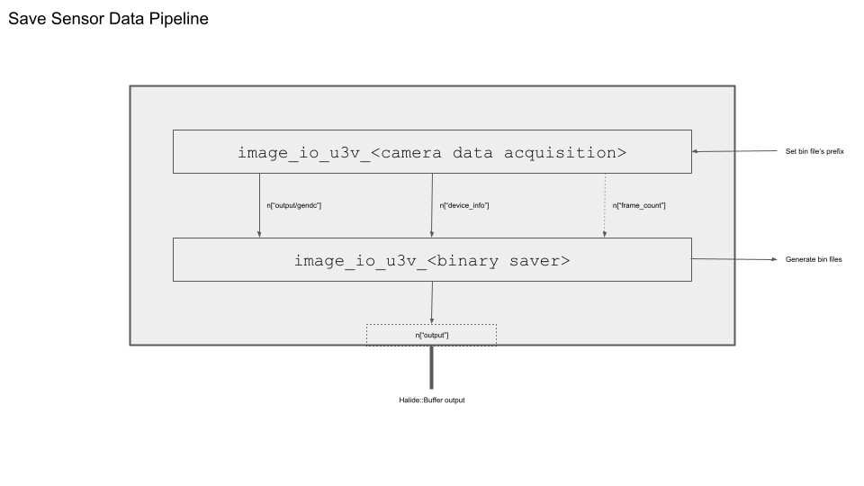
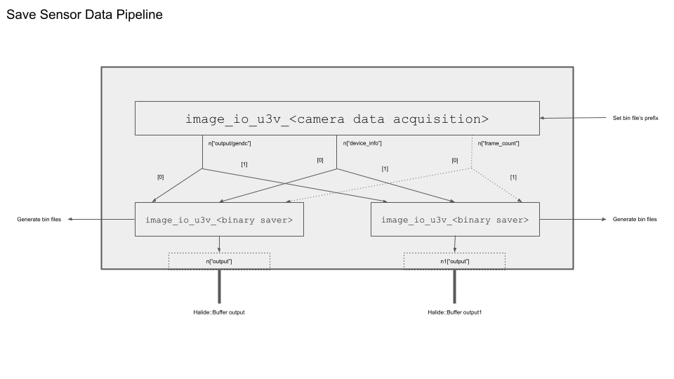

# センサーデータの保存

このチュートリアルでは、センサから転送されたデータをバイナリファイルに保存する方法を学びます。

## 前提条件

* ion-kit（sensing-dev SDKとともにインストール済み）

## チュートリアル

前のチュートリアルでは、パイプライン内でセンサーデータを取得するための単一のビルディングブロック（BB）を利用しました。今度は、バイナリセーバBBを組み込んで、1.データを取得し、2.パイプライン内でデータを保存という2段階のフローを有効にします。



### パイプラインを構築する

パイプライン `Builder` の初期化プロセスは、以前のチュートリアルとまったく同じです。

```c++
// パイプラインのセットアップ
Builder b;
b.set_target(ion::get_host_target());
b.with_bb_module("ion-bb");
```

センサデータ取得BBの後続のビルディングブロック（BB）として、バイナリセーバーBBを接続して、1.データを取得してから、2.パイプライン内でデータを保存というフローを確立します。

使用する具体的なビルディングブロック（BB）は、使用されているセンサーデータのタイプに依存します。このチュートリアルでは、GenDCデータを保存する方法を示す例を紹介します。

|           | データ取得BB                                    | バイナリセーバーBB                               |
|-----------|------------------------------------------------|--------------------------------------------------|
| GenDC     | image_io_u3v_gendc                             | image_io_u3v_binary_gendc_saver                  |
| 非GenDC   | image_io_u3v_cameraN_u&ltbyte-depth&gtx<dim&gt | image_io_binarysaver_u&ltbyte-depth&gtx&ltdim&gt |

パイプライン `b` に2つのBBを追加します。2番目のBBである `image_io_u3v_binary_gendc_saver` には、ポートにGenDCデータ、デバイス情報、およびペイロードサイズの3つの入力が必要です：

```c++
// データを取得するために最初のBBを追加します
Node n = b.add("image_io_u3v_gendc")();
// バイナリデータを保存するために2番目のBBを追加します
n = b.add("image_io_binary_gendc_saver")(n["gendc"], n["device_info"], &payloadsize);
```

GenDCデータとデバイス情報は、前のノードで取得された取得BBによって取得されます。ペイロードサイズは、コンソールで `arv-tool-0.8 -n <デバイス名> control PayloadSize` コマンドを使用して取得できるGenDCコンテナの全体サイズを表します。詳しい使用方法については、[arv-tool-0.8](../../external/aravis/arv-tools) を参照してください。

:::tip

### 非GenDCデータの場合

BBがGenDC向けに設計されている場合、 `frame_count` の入出力はありませんが、非GenDC BBでは必須となります。詳細については、以下の表を参照してください。

|           | データ取得BBの出力                            | バイナリセーバーBBの入力                       |
|-----------|----------------------------------------------|-----------------------------------------------|
| GenDC     | gendc; device_info                           | gendc; device_info; payloadsize               |
| 非GenDC   | output; device_info; frame_count             | output; device_info; frame_count; width; height|

widthとheightは、上記の例でペイロードサイズを取得したのと同様に、[arv-tool-0.8](../../external/aravis/arv-tools) を使用して取得できます。

### 複数センサーデータの場合

最初のBBで `Param("num_devices", 2)` を使用して複数のセンサーからデータを取得する場合、個々のバイナリセーバBBを使用してそれらを個別に保存する必要があります。1つのセンサーからのデータが他のセンサーからのデータを上書きを防ぐために、必ず以下のようなパイプライン構成にしてください。



最初のBBから各センサの出力データにアクセスするには、次のようにインデックス `[]` を使用します。各バイナリセーバBBに `Param("prefix", "gendc0-")` と `Param("prefix", "gendc1-")` を設定して、お互いの内容を上書きしないように注意してください。

```c++
Node n = b.add("image_io_u3v_gendc")().set_param(Param("num_devices", 2),);

if (num_device == 2){
    int32_t payloadsize1 = payloadsize[1];
    Node n1 = b.add("image_io_binary_gendc_saver")(n["gendc"][1], n["device_info"][1], &payloadsize1)
   .set_param(
       Param("prefix", "gendc1-"),
       Param("output_directory", saving_diretctory)
   );
   n1["output"].bind(outputs[1]);
}

int32_t payloadsize0 = payloadsize[0];
n = b.add("image_io_binary_gendc_saver")(n["gendc"][0], n["device_info"][0], &payloadsize0)
   .set_param(
       Param("prefix", "gendc0-"),
       Param("output_directory", saving_diretctory)
   );
n["output"].bind(outputs[0]);
```

複数のセンサのペイロードサイズがそれぞれ正しいことを確認してください。
```C++
# bind input values to the input port
std::vector<int32_t> payloadsize = {2074880, 2074880};
int32_t payloadsize0 = payloadsize[0];
...
n = b.add("image_io_binary_gendc_saver")(n["gendc"][0], n["device_info"][0], &payloadsize0)
...
```

:::

### 出力ポートを設定する

バイナリファイルはバイナリセーバBBプロセス内に保存されますが、パイプラインからはスカラ出力が得られます。

これは、BBがデータを正常に保存したかどうかを示す終端フラグであるため、値そのものを使うことはほとんどありません。しかし、この出力を受け取るためのバッファは必ず作成する必要があります。

```c++
Halide::Buffer<int> output = Halide::Buffer<int>::make_scalar();
n["output"].bind(output);
```

### パイプラインを実行する

通常通りに `builder.run()` を実行してパイプラインを終了します。

デフォルトでは、バイナリデータは次の形式で保存されます： `<output directory>/<prefix>0.bin`、`<output directory>/<prefix>1.bin`、`<output directory>/<prefix>2.bin` などです。デフォルトの出力ディレクトリはカレントディレクトリで、デフォルトのプレフィックスは `raw-` です。これらの値をカスタマイズするには、バイナリセーバBB内の `Param` を使用してください。

## 完全なコード

import {tutorial_version} from "@site/static/version_const/v240505.js"
import GenerateTutorialLink from '@site/static/tutorial_link.js';

<GenerateTutorialLink language="cpp" tag={tutorial_version} tutorialfile="tutorial4_save_data" />

