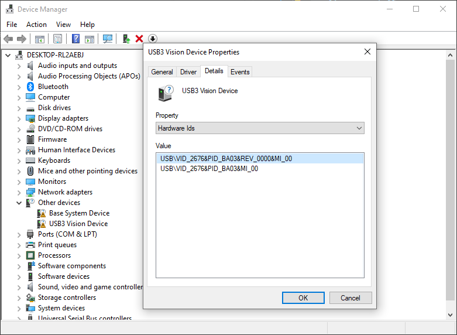

# Installation - Windows

This document describes the steps to install the software development environment for U3V camera on Windows.

import '/src/css/home.css';
import this_version from "@site/static/version_const/v2405.js"
import AddMsiInstructionIfLatest from '@site/static/msi_instruction_if_latest.js';

<a class="card" href={this_version.latest_installer_URL}>DL Windows 64-bit Package</a>

## Expected environment

In this document, the following environment is assumed.

* OS: Windows 10/11, 64 bit version
* Development environment (One of them)
    * Python 3.11 (with VS Code)
    * C++: Visual Studio 2019/2022 (17.09 or earlier)
* Hardware:
    * USB3.0 compatible USB port x2

:::info
If you are using MSVC 2022 (17.10 or later), install OpenCV 4.10.0 or later from [the officieal website](https://opencv.org/).
Do not forget to add the directory containing the DLL library to the `PATH` environment variable. See the detail in [Update OpenCV](../external/OpenCV/update-opencv).
:::

## Prerequisite

* Python 3.11

## Sensing-dev Software Packages

Please DL the installer script at the top of the page or <a href={this_version.latest_installer_URL}>here</a>.

Open the powershell terminal and move to the directory where you have the installer script downloaded in the previous step.

Then type the following command. If you do not have and need OpenCV, you can add `-InstallOpenCV` option.

<pre>
<code class="language-powershell">
installer.ps1 -user &lt;username&gt; {this_version.windows_version_option}
</code>
</pre>

The default installation path would be `"C:\Users\<username>\AppData\Local\sensing-dev"`.

:::caution why it does not work
When you get 

> installer.ps1 cannot be loaded because running scripts is disabled on this system

your powershell does not allow to run the script. If so, please add `-ExecutionPolicy Bypass` option as the following example:

<pre>
<code class="language-powershell">
{this_version.one_line_install}
</code>
</pre>

:::

If you with to use python-binding (ionpy), please install with pip.

<pre>
<code class="language-bash">
pip3 install -U pip 
pip3 install ion-python=={this_version.ion_python_version} 
pip3 install gendc-python=={this_version.gendc_python_version} 
</code>
</pre>

## Install WinUSB driver on U3V device.

This step is only required the first time a U3V camera device is connected to a host machine.
1. To apply WinUSB to the target USB device, you need to know Vendor ID and Product ID of the device.
Check your U3V camera device using **Device Manager**.
In the search box on the taskbar, type device manager, then select Device Manager from the menu.

The image shows there are two unknown U3V camera devices connected on my host machine and we need to install the WinUSB driver. 
You now double-click the U3V camera device and select the **Details** tab on the pop up window. 
From the dropdown menu, choose **Hardware Ids** and now you can see the Vendor ID in the box following `VID_`, and Product after `PID_BA03`. 
In the example below, they are `2676` and `BA03` respectively. 

2. Execute the following command on powershell console with Vendor ID that you checked in the step1. This process may take up to 5 minutes.
<pre>
<code class="language-powershell">
{this_version.one_line_powershell} &lt;Vendor ID&gt; &lt;Product ID&gt;
</code>
</pre>

* Example with some U3V camera devices

|                     | Vendor ID | Product ID |
|---------------------|-----------|------------|
| Basler daA1280-54uc | 2676      | BA03       |
| Sony Kizashi1.2     | 054C      | 0D7D       |

:::tip If you want to uninstall driver

1. Open Device Manager again, and right click on your device and choose uninstall device.

2. Click the checkbox and click uninstall device

3. Open Action and click scan for hardware changes

If your device is displaying as an unknown device, congratulations! The WinUSB driver has been successfully uninstalled!
:::

## Set environment variables.

Running the installer.ps1 script would **automatically set** the environment variable `%PATH%` and `%SENSING_DEV_ROOT%` which SDK requires, so you may skip this step.

However, if you change the default path or move the package location, it requires to set them manually with the following precedure:

1. Hit Windows key **&#8862;** or click **&#8862;** at the corner of task bar to use start-menu.

2. Type **Environment variable** to find **Edit environment variables got your account** to open the window of **Environment Variables**.

3. There's environment variables for user and system at the top and bottom of the window respectively, and we edit user variables.

4. With `New` and `Edit`, set the following environment variables.

| Name of variable | Value | New/Edit(append) |
| --------   | ------- | ------- |
| SENSING_DEV_ROOT | `<where you installed SKD>` | NEW |
| PATH | `<where you installed SKD>/bin` | Edit(append) |

:::info Confirmation
Using `arv-tool-0.8` may help to check if the software package is appropriately installed. Please check [this page](../external/aravis/arv-tools.md) to know the procedure.
:::